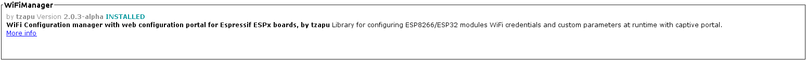
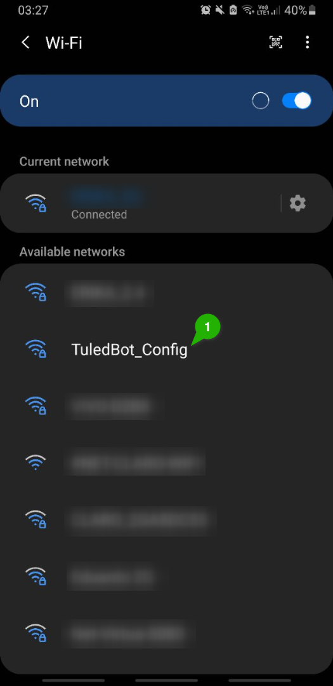
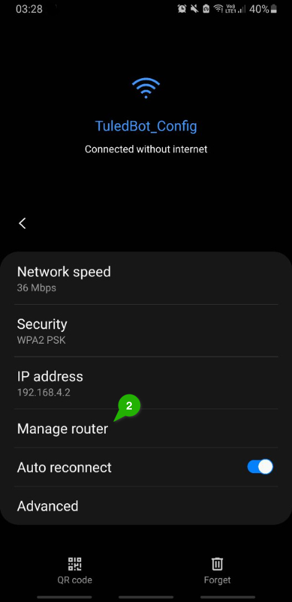
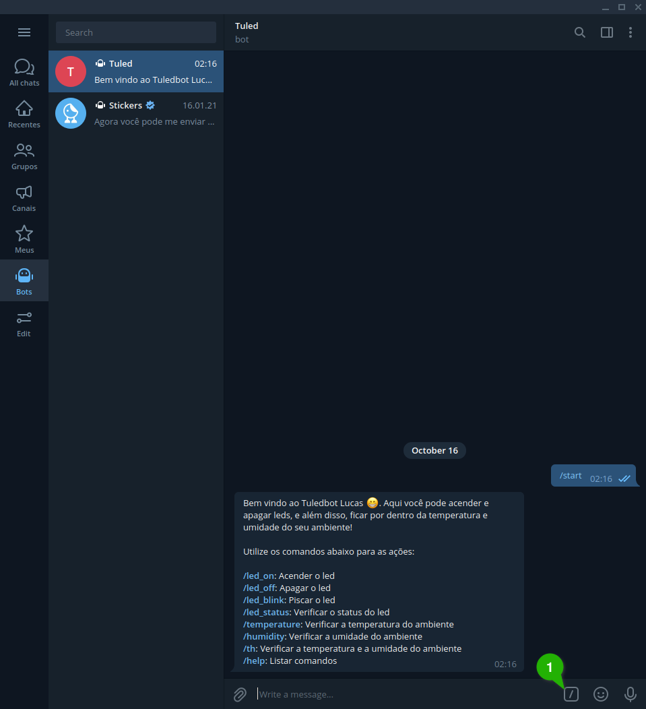

# TuledBOT
**Alunos:** Lucas Sargeiro Gomes de Mello; Marcelo Henrique Untersander Pereira de Barros.


### Projeto

O TuledBOT é um projeto criado para a disciplina de IoT do CEFET-RJ. O projeto consistem em um BOT (robô)  para o [Telegram](https://telegram.org) que se comunica com o ESP8266 e serve como interface para acender e apagar um led, e buscar informações de temperatura e humidade.


### Componentes

Os componentes utilizados no projeto foram:

- Led vermelho;
- Sensor DHT11 (temperatura e umidade);
- ESP8266;
- Jumpers;
- Resistores diversos;


### Conexão dos componentes

A conexão dos componentes foi colocada como apresentada na imagem abaixo:

.


explicação...


### Arquitetura

Com o objetivo de separar as responsabilidades e manter o código organizado o programa foi divido em alguns módulos, sendo eles:

- **tuledbot:** Módulo principal, onde todo o programa é centralizado. Nesse módulo temos apenas os *setups* e *loops* de cada módulo;
- **_pinout:** Módulo responsável pelo mapeamento dos pinos;
- **wifi:** Módulo responsável pela conexão WiFi. Esse módulo implementa o Wif Manager para que os dados de conexão sejam inseridos pelo usuário;
- **ota:** Módulo responsável pelas atualizações do programa pela porta de rede;
- **dht:** Módulo responsável por fazer a leitura de umidade e temperatura;
- **led:** Módulo responsável por acender e apagar o led;
- **telegram:** Módulo responsável por realizar a comunicação entre o *Telegram* e o ESP8266 realizando as tarefas solicitadas.


Cada módulo expoõe aos outros as funções necessárias para realizar cada uma das ações que podem ser solicitadas no *Telegram* ou para configurar o ESP. Foi definido que, para cada módulo, quando necessário, teria uma função com o sufixo *Init*, que seriam incluidas ao *setup()* do projeto e uma função com o sufixo *Loop* que seriam incluidas no *loop()* principal do projeto.


## Implementação

A implementação do programa foi feita através da IDE do Arduino e foi necessário a instalção de algumas bibliotecas, sendo elas:




### Módulo TuledBOT

O módulo **Tuledbot**  é composto pelo arquivo`tuledbot.ino` . Esse módulo tem o objetivo de centralizar todo os *setups* e *loops* necessários para a execução do ESP.  Nele são importados as funções expostas pelos outros módulos para inicialização e execução e, quando necessário, são definidos os pinos que serão executados em cada módulo.

```cpp
#include <ESP8266WiFi.h>

void serialInit();
void wifiInit(bool resetSettings);
void otaInit();
void dhtInit();

void wifiLoop();
void otaLoop();
void dhtLoop();

void setup() {
    serialInit();
    wifiInit(false);
    otaInit();
    ledInit(D0);
    dhtInit(D1);
    telegramInit();
}

void loop() {
    wifiLoop();
    otaLoop();
    telegramLoop();
}

void serialInit(){
    Serial.begin(115200);
}
```


### Módulo Pinout

O módulo **Pinout** é composto pelo arquivo `_pinout.ino`. Esse módulo foi criado com o objetivo de mapear os pinos do ESP, nele também são comentados os pinos utilizados por cada módulo, apenas para registro.

```cpp
#include <Arduino.h>

#define D0    16          // PINO DO LED
#define D1    5           // PINO DO DHT
#define D2    4 
#define D3    0 
#define D4    2 
#define D5    14  
#define D6    12 
#define D7    13 
#define D8    15 
#define D9    3  
#define D10   1  
```

> A biblioteca *Arduino.h* deve ser importada para garantir que no momento da compilação esse outro arquivo também será analisado.


### Módulo WiFi

O modulo **WiFi** é composto pelo arquivo `wifi.ino`. Esse módulo foi criado com o objetivo de configurar as credencias de rede, sem precisar inserir essas no código. Quando o ESP é ligado pela primeira vez, ele entra no modo *acess point*, e uma vez nesse modo, através de qualquer dispositivo com conexão WiFi, você poderá encontrar a rede *TuledBot_Config*.

Para configurar os dados de acesso basta se conectar nessa rede com a senha *"senha123"* e você será direcionado a página de configuração do acesso. Caso você não seja direcionado automaticamente, procure pelo botão que leva até a página de configuração da rede. O passo a passo para configurar pode ser visto abaixo:




```cpp
#include <Arduino.h>
#include <WiFiManager.h>
#include <ESP8266WebServer.h>

const char* WIFI_HOSTNAME = "Tuledbot";
const char* WIFI_SSID = "TuledBot_Config";
const char* WIFI_PASSWORD = "senha123";

void wifiManagerConfig(bool resetSettings);

void wifiInit(bool resetSettings) {
    WiFi.hostname(WIFI_HOSTNAME);
    wifiManagerConfig(resetSettings);
}

void wifiManagerConfig(bool resetSettings) {
    Serial.println("\n--- Starting wifi configuration ---");
    WiFiManager wifiManager;
    
    if (resetSettings) {
        Serial.println("Reseting credentials...");
        wifiManager.resetSettings();
    }
    
    wifiManager.autoConnect(WIFI_SSID, WIFI_PASSWORD);
    Serial.println("--- Finished wifi configuration ---");
}

void wifiLoop() {
    
    if (WiFi.status() == WL_CONNECTED){
        return;
    }

    Serial.println("\n--- Starting WiFi Connection ---");

    WiFi.hostname(WIFI_HOSTNAME);
    WiFi.begin();

    while (WiFi.status() != WL_CONNECTED) {
        delay(100);
        Serial.println(".");
    }
   
    Serial.print("Conectado com sucesso na rede: ");
    Serial.println(WIFI_SSID);

    Serial.println("--- End WiFi Connection ---");
}
```

> A biblioteca *Arduino.h* deve ser importada para garantir que no momento da compilação esse outro arquivo também será analisado.


Esse módulo expoẽs 3 métodos para os demais módulos, são eles:

-  `wifiInit(bool resetSettings)`: Esse é o método responsável por iniciar o serviço do WiFi Manager. O método recebe um parâmetro que indica se as configurações salvas devem ser  utilizadas ou se os dados devem ser excluidos;

- `wifiManagerConfig(bool resetSettings)` : Esse método é utilizado para realizar a conexão com o Wifi. O método recebe um parâmetro que indica se a conexão será realizada com os dados salvos ou se novos dados devem ser incluidos. Em geral esse método não precisa ser chamado por outros módulos já que o próprio método de *setup* utiliza ele, porém, caso seja desejado resetar as configurações de acesso durante a execução do programa ele pode ser utilizado;

- `WifiLoop()`: Esse método é utilizado para manter a conexão ativa. O método verifica o estado da conexão, e caso tenha sido interrompida, ele tenta reconectar. Esse método deve ser chamado dentro do *loop* principal do programa para realizar as reconexões.

  


### Módulo OTA

O módulo **OTA** é composto pelo arquivo `ota.ino`.  Esse módulo foi criado com o objetivo de permiti que o ESP tivesse seu *firmware* atualizado sem a necessidade de ter ele conectado a um computador pelo cabo. O OTA permite que, se ambos os equipamentos estiverem conectados na mesma rede, o binário possa ser carregado através de uma porta de rede.

Para o usuário o OTA é transparente, sem a necessidade de quaisquer interação para atualização, e totalmente seguro, já que é necessário uma senha para atualização do *firmware*.

```cpp
#include <Arduino.h>
#include <ArduinoOTA.h>

const char* OTA_HOSTNAME = "TuledBot_OTA";
const char* OTA_SSID = "TuledBot_OTA";
const char* OTA_PASSWORD = "senha";

void otaOnStart();
void otaOnProgress(unsigned int progress, unsigned int total);
void otaOnEnd();
void otaOnError(ota_error_t error);

void otaInit() {
    ArduinoOTA.setHostname(OTA_HOSTNAME);
    ArduinoOTA.setPassword(OTA_PASSWORD);
    
    ArduinoOTA.onStart(otaOnStart);
    ArduinoOTA.onEnd(otaOnEnd);
    ArduinoOTA.onProgress(otaOnProgress);
    ArduinoOTA.onError(otaOnError);

    ArduinoOTA.begin();
}

void otaLoop() {
    ArduinoOTA.handle();
}

void otaOnStart() {
    Serial.println("\n--- OTA Start ---");
}

void otaOnProgress(unsigned int progress, unsigned int total) {
    Serial.printf("Progress: %u%%\r", (progress / (total / 100)));
}

void otaOnEnd() {
    Serial.println("--- OTA End ---");
}

void otaOnError(ota_error_t error) {
    Serial.printf("Error[%u]: ", error);
    
    if(error == OTA_AUTH_ERROR){
        Serial.println("Auth Failed");    
    } 
    else if(error == OTA_BEGIN_ERROR){
        Serial.println("Begin Failed");
    }
    else if(error == OTA_CONNECT_ERROR){
        Serial.println("Connect Failed");
    }
    else if(error == OTA_RECEIVE_ERROR){
        Serial.println("Receive Failed");
    }
    else if(error == OTA_END_ERROR){
        Serial.println("End Failed");
    }
}
```

> A biblioteca *Arduino.h* deve ser importada para garantir que no momento da compilação esse outro arquivo também será analisado.


ara fim de apresentação colocamos a senha *"senha"* para atualização, mas por questões de segurança é necessário colocar uma senha mais segura. Esse módulo expões aos demais módulos as funções:

- `otaInit()`: Esse método é responsável por configurar o OTA. Nesse método são configurados os *hotname* e senha, para atualização do programa, além das funções de *callback* para cada momento da execução do OTA;
- `otaLoop()`: Esse método é responsável por manter o OTA em execução, para que isso seja possível é necessário que esse método seja chamado dentro do*loop* principal do programa;
- `otaOnStart()`:  Usando como *callback* quando o OTA é iniciado. Esse método é utilizado para sabermos que o módulo iniciou sem nenhum problema;
- `otaOnProgress()`: Usando como *callback* quando o OTA está subindo as atualizações. Esse método é utilizado para sabermos o progresso do evio;
- `otaOnEnd()`: Usando como *callback* quando o OTA é finalizado. Esse método é utilizado para sabermos caso o módulo seja finalizado;

- `otaOnError()`: Usando como *callback* quando o OTA acaba encontrando algum erro. Esse método é utilizado para não nos depararmos com um erro sem saber.


### Módulo DHT

O módulo **DHT** é composto pelo arquivo `dht.ino`. Esse módulo é responsável por realizar as medições de temperatura e umidade do ambiente. Para realização das medições foi utilizado o sensor DHT11. Embora esse sensor tenha apresentado dificuldade para conectar, depois de muita tentativa ele serviu bem.

 **Sensor DHT11**

```cpp
#include <Arduino.h>
#include <DHT.h>

DHT* dht;

void dhtPrintMessage(float humidity, float temperature);

void dhtInit(int PIN) {
    dht = new DHT(PIN, DHT11);
  
    Serial.println("--- Starting DHT ---");
    (*dht).begin();
}


void dhtLoop() {
    float humidity    = (*dht).readHumidity();
    float temperature = (*dht).readTemperature();
    
    if (isnan(temperature) || isnan(humidity)) {
        Serial.println("--- Failed to read from DHT ---");
    }
    else {
        dhtPrintMessage(humidity, temperature);
    }

    delay(2000);
}

float dhtGetTemperature() {
    return (*dht).readTemperature();
}

float dhtGetHumidity() {
    return (*dht).readHumidity();
}

void dhtPrintTemperatureAndHumidityStatus(float humidity, float temperature) {
    Serial.print("--- Umidade: ");
    Serial.print(humidity);
    Serial.println(" %t       ---");
    Serial.print("--- Temperatura: ");
    Serial.print(temperature);
    Serial.println(" *C   ---");
}
```

> A biblioteca *Arduino.h* deve ser importada para garantir que no momento da compilação esse outro arquivo também será analisado.


O módulo criado expoõe  5 métodos para os demais:

- `dhtInit(int PIN)`: Esse método é responsável por iniciar o DHT11. O método é utilizado para iniciar o sensor, e para isso, ele recebe um parâmetro que define qual será o pino responsável por trocar dados do sensor;

- `dhtLoop()`: Esse método é responsável por realizar a leitura de temperatura e umidade  a cada 2 segundos e mostrar os valores no monitor serial. Para que esse método execute como esperado ele deve ser incluido no *loop* principal do programa;

- `dhtGetTemperature()`: Esse método serve para realizar a leitura da temperatura e retornar esse valor;

- `dhtGetHumidity()`: Esse método serve para realizar a leitura da umidade e retornar esse valor;

- `dhtPrintTemperatureAndHumidityStatus(float humidity, float temperature)`: Esse método é utilizado para mostrar valores de determinada temperatura e umidade no monitor serial.


### Módulo Led

O módulo **Led** é composto pelo arquivo `led.ino`. Esse módulo é responsável por controlar o led incluido no projeto. Para o nosso trabalho foi utilizado um led vermelho. Para acender o led é necessário acionar o valor *HIGH* no pino que o led está conectado, e para apagar, basta acionar o valor *LOW*.

 **Led**

```cpp
#include <Arduino.h>

int PIN_LED;
int led_status = 0;

void ledInit(int PIN){
    PIN_LED = PIN;
  
    pinMode(PIN_LED, OUTPUT);
    digitalWrite(PIN_LED, LOW);
}

void ledTurnOn(){
  Serial.println("--- Led Aceso               ---");
  digitalWrite(PIN_LED, HIGH);
  led_status = 1;
}


void ledTurnOff(){
  Serial.println("--- Led Apagado             ---");
  digitalWrite(PIN_LED, LOW);
  led_status = 0;
}

int getLedStatus() {
    return led_status;
}

void ledBlink(int time){
    Serial.println("--- Piscando Led            ---");
    
    ledTurnOn();
    delay(time);
    ledTurnOff();
}
```

> A biblioteca *Arduino.h* deve ser importada para garantir que no momento da compilação esse outro arquivo também será analisado.


O módulo Led expõe 5 métodos para os demais módulos:

- `ledInit(int PIN)`: Esse método é responsável por iniciar led. Esse método recebe como parâmetro o pino que será utilizado para trocar informações com o led;

- `ledLoopOn()`: Esse método é responsável por acender o led atualizando o estado atual dele. Além disso o método nos avisa pelo monitor serial que o led acendeu;

- `ledTurnOff()`: Esse método é responsável por apagar o led atualizando o estado atual dele. Além disso o método nos avisa pelo monitor serial que o led apagou;

- `ledTurnStatus()`: Esse método é responsável por indicar o estado atual do led, 1 caso esteja aceso e 0 se estiver apagado;

- `ledBlink(int time)`: Esse método é responsável por piscar o led. O método recebe como parâmetro um tempo em milissegundos, que representa quanto tempo o led ficará aceso. Além disso o método nos avisa pelo monitor serial que o led piscou.


### Módulo Telegram

O módulo **Telegram** é composto pelo arquivo `telegram.ino`. Esse módulo é responsável por conectar o ESP ao *Telegram* através de um BOT. O próprio Telegran possui uma [API](https://core.telegram.org/bots) criada para construção de BOTs . Em resumo, você cadastra um BOT utilizando um outro BOT do Telegram, chamado *The Botfather*, e ele libera um *token* de acesso a API deles.

Para construção do nosso BOT, definimos alguns comandos que são apresentados para o usuário assim que ele entra em contato com BOT:


Os comandos podem ser acionados tanto pelo teclado, quando a pessoa digita, quanto clicando nos comando enviados no começo da conversa (destacados em azul na mensagem).

Para a construção do módulo foi necessários definirmos algumas variáveis que são utilizadas para se conectar com a API do *Telegram*, como o *token* recebido pelo *Bot Father*. Além disso, foi necessário importar o certificado SSL do *Telegram* e criar um cliente seguro para se conectar a API. Uma vez feito isso tudo, podemos criar a instância do nosso BOT.

Agora que temos a instância do BOT falta apenas sincronizarmos nosso relógio com o UTC e já poderemos realizar a comunicação.

```cpp
#include <Arduino.h>
#include <UniversalTelegramBot.h>


#define BOT_TOKEN "2040806579:AAFrN7RYxL6h260BjmduyIgzJEtwhUg00RY"

unsigned long bot_last_scan_time;
const unsigned long BOT_SCAN_INTERVAL = 100;


X509List cert(TELEGRAM_CERTIFICATE_ROOT);
WiFiClientSecure wifi_secure_client;
UniversalTelegramBot bot(BOT_TOKEN, wifi_secure_client);


void setupUTCTime();
void setupTelegramCommandsDescription();


void telegramInit() {
    setupUTCTime();
    setupTelegramCommandsDescription();
}


void telegramLoop() {
    if(millis() - bot_last_scan_time < BOT_SCAN_INTERVAL) return;
    
    int totalNewMessages = bot.getUpdates(bot.last_message_received + 1);
    
    while (totalNewMessages){
        Serial.print("Nova solicitação: ");
        handleNewMessages(totalNewMessages);
        totalNewMessages = bot.getUpdates(bot.last_message_received + 1);
    }
    
    bot_last_scan_time = millis();
}


void setupTelegramCommandsDescription() {
    String commands ="[";
    commands += "          {\"command\":\"led_on\",     \"description\":\"Liga o LED\"},";
    commands += "          {\"command\":\"led_off\",    \"description\":\"Desliga o LED\"},";
    commands += "          {\"command\":\"led_blink\",    \"description\":\"Pisca o LED\"},";
    commands += "          {\"command\":\"led_status\", \"description\":\"Status do LED\"},";
    commands += "          {\"command\":\"temperature\",\"description\":\"Retorna a temperatura do ambiente\"},";
    commands += "          {\"command\":\"humidity\",   \"description\":\"Retorna a umidade do ambiente\"},";
    commands += "          {\"command\":\"th\",         \"description\":\"Retorna a temperatura e a umidade do ambiente\"},";
    commands += "          {\"command\":\"help\",       \"description\":\"Lista os possiveis comandos\"}";
    commands += "     ]";
    bot.setMyCommands(commands);
}


void setupUTCTime() {
    Serial.println("--- configurtando UTC ---");
    
    configTime(0, 0, "pool.ntp.org");
    wifi_secure_client.setTrustAnchors(&cert); // Root certificate for api.telegram.org

    // Sync NTP/Time
    time_t now = time(nullptr);
    while (now < 24 * 3600){
      delay(100);
      now = time(nullptr);
    }
    Serial.println("--- UTC configurado com sucesso ---");
}


/* ---------------------------------- MESSAGE CALLBACKS ------------------------------------ */

void led_on_and_notify(String chat_id) {
    ledTurnOn();
    bot.sendMessage(chat_id, "Led *LIGADO*", "Markdown");
}


void led_off_and_notify(String chat_id) {
    ledTurnOff();
    bot.sendMessage(chat_id, "Led *DESLIGADO*", "Markdown");
}

void led_blink_and_notify(String chat_id){
    ledBlink(10);
    bot.sendMessage(chat_id, "Led *PISCOU*", "Markdown");
}


void led_status_and_notify(String chat_id) {
    int ledStatus = getLedStatus();
    if(ledStatus){
        bot.sendMessage(chat_id, "Led *LIGADO*", "Markdown");
    }else{
        bot.sendMessage(chat_id, "Led *DESLIGADO*", "Markdown");    
    }
}


void temperature(String chat_id) {
    float temperature = dhtGetTemperature();
    String message = "Temperatura atual: " + (String) temperature;
    
    bot.sendMessage(chat_id, message, "");
}


void humidity(String chat_id) {
    float humidity = dhtGetHumidity();
    String message = "Umidade atual: " + (String) humidity;
    
    bot.sendMessage(chat_id, message, "");
}


void th(String chat_id){
    float temperature = dhtGetTemperature();
    float humidity = dhtGetHumidity();

    String message = "Temperatura: " + (String) temperature + "\n" + "Umidade: " + (String) humidity;
    bot.sendMessage(chat_id, message, "");
}


void help(String chat_id, String username){
    String welcome = "Bem vindo ao Tuledbot " + username + " 😁. Aqui você pode acender e apagar leds, e além disso, ficar por dentro da temperatura e umidade do seu ambiente!\n\n";
    welcome += "Utilize os comandos abaixo para as ações:\n\n";
    welcome += "*/led_on*: Acender o led\n";
    welcome += "*/led_off*: Apagar o led\n";
    welcome += "*/led_blink*: Piscar o led\n";
    welcome += "*/led_status*: Verificar o status do led\n";
    welcome += "*/temperature*: Verificar a temperatura do ambiente\n";
    welcome += "*/humidity*: Verificar a umidade do ambiente\n";
    welcome += "*/th*: Verificar a temperatura e a umidade do ambiente\n";
    welcome += "*/help*: Listar comandos\n";
    bot.sendMessage(chat_id, welcome, "Markdown");
}


void handleNewMessages(int numNewMessages){
    for (int i = 0; i < numNewMessages; i++){
        String chat_id = bot.messages[i].chat_id;
        String text = bot.messages[i].text;
        String from_name = bot.messages[i].from_name;
    
        Serial.println(text);
        
        if (from_name == ""){
          from_name = "desconhecido";
        }
    
        if (text == "/led_on") led_on_and_notify(chat_id);
        if (text == "/led_off") led_off_and_notify(chat_id);
        if (text == "/led_blink") led_blink_and_notify(chat_id);
        if (text == "/led_status") led_status_and_notify(chat_id);
        if (text == "/temperature") temperature(chat_id);
        if (text == "/humidity") humidity(chat_id);
        if (text == "/th") th(chat_id);
        if (text == "/help" || text == "/start") help(chat_id, from_name);
    }
}
```

> A biblioteca *Arduino.h* deve ser importada para garantir que no momento da compilação esse outro arquivo também será analisado.


Esse módulo expõe 12 métodos para os demais módulos:

- `telegramInit()`: Esse método é responável por inicial o BOT. O método inicia as configurações necessárias para nos comunicarmos com o *Telegram* e inicializa as opções de comando junto com uma leve descrição;
- `telegramLoop()`: Esse método é responsável por manter a conexão com o Telegram ativa. A todo momento ele verifica se existe alguma mensagem pendente que o BOT não tenha visto ainda, e caso tenha, manda aquela mensagem para ser resolvida. Para não precisamos buscar por novas mensagens a cada milissegundo, podemos definir um tempo de busca por novas mensagens e só verificar após aquele tempo;
- `setupTelegramCommandsDescription()`: Esse método é responsável por atualizar os comandos possíveis para se utilizar no BOT, junto com uma leve descrição. Essa descrição dos comandos serve para que o *Telegram* possa sugerir as opções ao usuário<sup>*</sup>;
- `setupUTCTime()`: Esse método é responsável por buscar o horário UTC em um servidor NTP e sincronicar o relógio do ESP nesse horário. Isso é feito para que as requisições possam acontecer sem problemas;
- `led_on_and_notify(String chat_id)`: Esse método é responsável por acender o led e notificar a determinado usuário que isso aconteceu;
- `led_off_and_notify(String chat_id)`: Esse método é responsável por apagar o led e notificar a determinado usuário que isso aconteceu;
- `led_blink_and_notify(String chat_id)`: Esse método é responsável por piscar o led (com um tempo de 10 ms.) e notificar a determinado usuário que isso aconteceu;
- `led_status_and_notify(String chat_id)`: Esse método é responsável por buscar o estado do led e notificar a determinado usuário esse estado;
- `temperature(String chat_id)`: Esse método é responsável por buscar a temperatura do ambiente e notificar a determinado usuário essa temperatura;
- `humidity(String chat_id)`: Esse método é responsável por buscar a umidade do ambiente e notificar a determinado usuário essa umidade;
- `th(String chat_id)`: Esse método é responsável por buscar a temperatura e a umidade do ambiente e notificar a determinado usuário os valores encontrados;
- `help(String chat_id, String username)`: Esse método é responsável por notificar certo usuário as opções disponíveis para comandos, esse método chama o usuário pelo nome caso ele tenha um nome público no *Telegram*;
- `handleNewMessages(int numNewMessages)`: Esse método é responsável por lidar com as requisições dos usuários. Sempre que um usuário envia um pedido, essa função identifica o pedido e chama a função responsável por aquela ação passando sempre o identificador do usuário que enviou a mensagem, para quele possa ser avisado após a conclusão da tarefa. Essa função recebe como parâmetro o número de mensagens não lidas para realizar todas as tarefas pendentes.


<sup>*</sup> As opções definidas são apresentadas sempre que um usuário digita o caractere "/" ou quando clica no botão disponível para as opções. A imagem abaixo mostra o botão disponível e como as opções são oferecidas.


